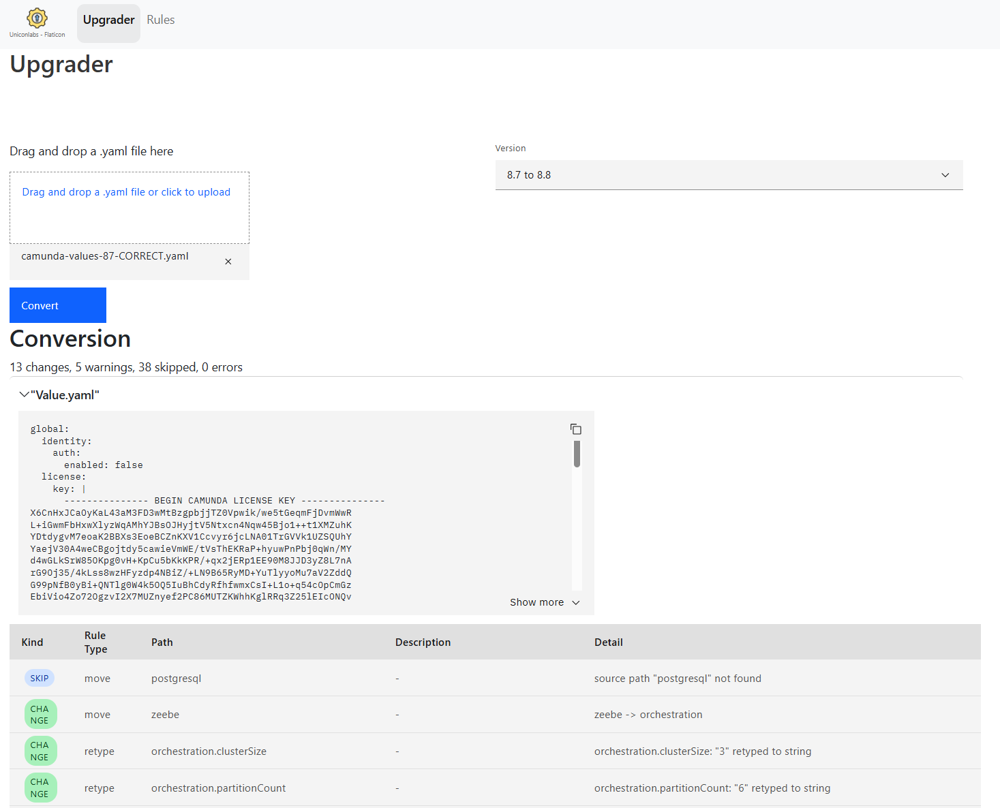
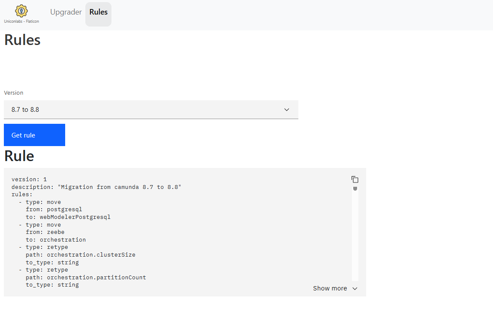

A lot of changes were introduced in version 8.8. The `values.yaml` structure changed significantly: some parameters were renamed, others were added, and several sections were reorganized.

This tool takes a `values.yaml` file and migrates it:
- from `8.7` to `8.8`
- or from `8.8` to `8.9`

# How to install

Clone and build the project (Spring Boot + React).

You can then:
- run it locally
- or use the Docker image and deploy it into your Kubernetes cluster.

See [README.md](k8s/README.md)

# How to use

## Convert

1. Drag and drop your `values.yaml` file
2. Select the upgrade path:
    - `8.7 → 8.8`
    - `8.8 → 8.9`
3. Click **Convert**

The migrated `values.yaml` file will be generated automatically.

Check the status and warnings displayed in the report.

## Rules

The rules applied during the migration are visible in the **Rules** tab.

